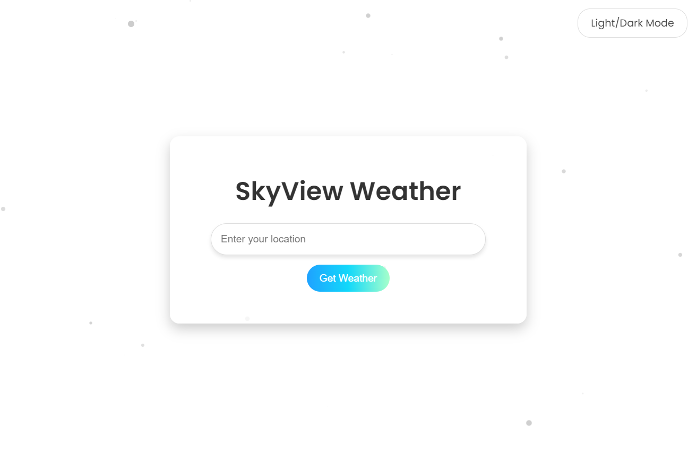
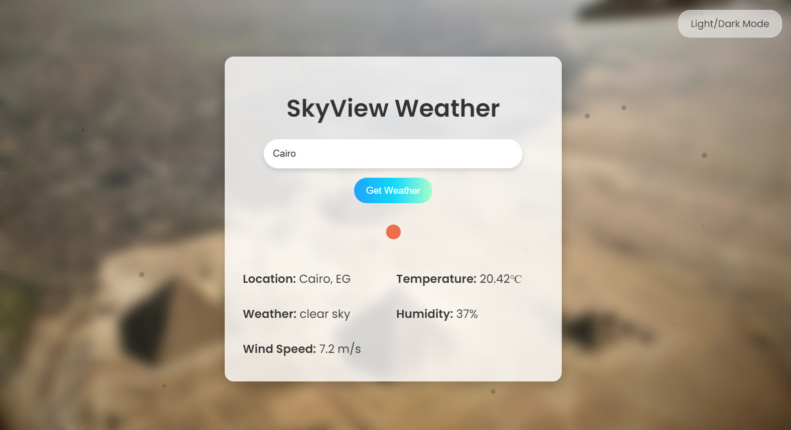
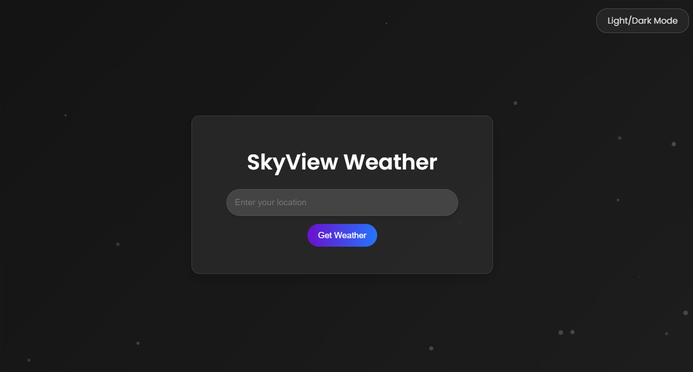

# SkyView

## Features
1. **Real-Time Weather Information**:
   - Fetches temperature, weather conditions, humidity, and wind speed for the input location.
   - Displays corresponding weather icons dynamically.

2. **Background Customization**:
   - Changes background based on specific city names (e.g., Paris, London, Giza).
   - Default background for unspecified locations.

3. **Light/Dark Mode**:
   - Switch seamlessly between light and dark themes.

4. **Dynamic Animations**:
   - Flicker effects for an engaging visual design.
   - Smooth fade-in effects for weather details.

5. **User-Friendly Interface**:
   - Minimalist input field for location search.
   - Clear, responsive layout suitable for all devices.

---

## APIs Used
1. **OpenWeatherMap API**:
   - URL: `https://api.openweathermap.org/data/2.5/weather`
   - Purpose: Fetches real-time weather data, including temperature, humidity, wind speed, and weather conditions.
   - Key Parameters:
     - `q`: City name
     - `units`: Metric system for temperature (`metric`)
     - `appid`: API key for authentication

2. **OpenWeatherMap Weather Icons**:
   - URL: `http://openweathermap.org/img/wn/`
   - Purpose: Provides icons representing current weather conditions.
   - Usage: Append the weather icon code followed by `@2x.png`.
   - Example:
     ```bash
     http://openweathermap.org/img/wn/10d@2x.png
     ```

---

## Screenshots

### 1. Home Page (Default)


### 2. Weather Details Displayed


### 3. Dark Mode

